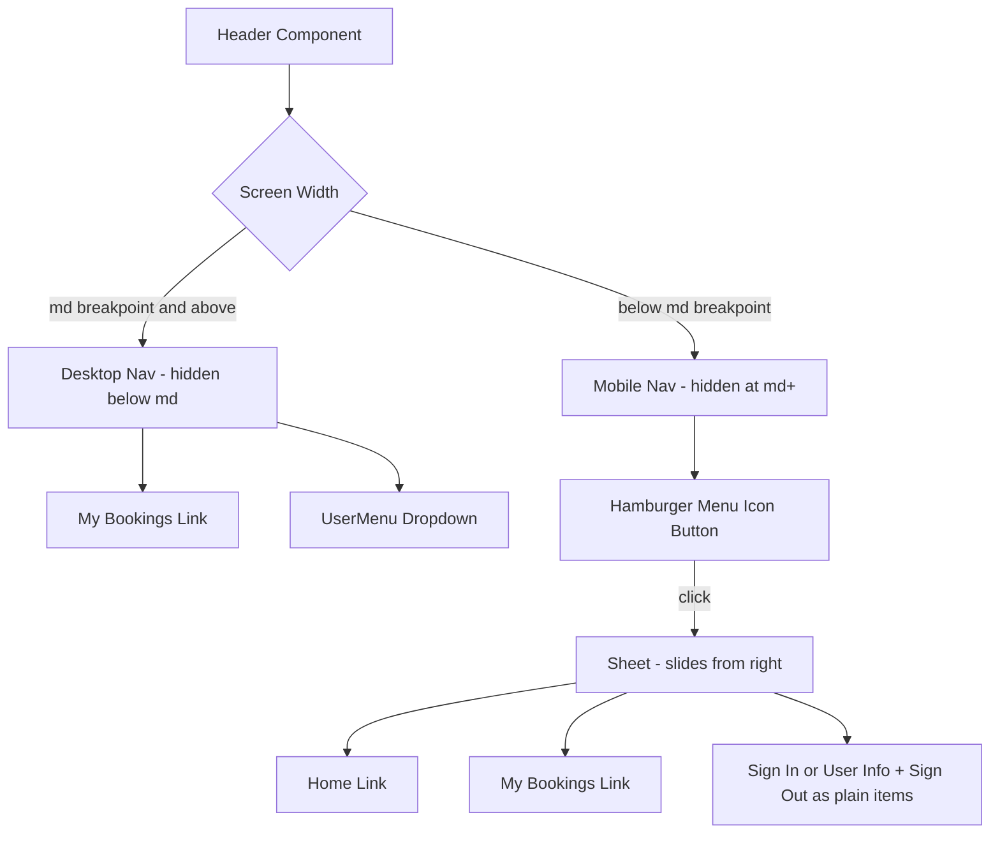
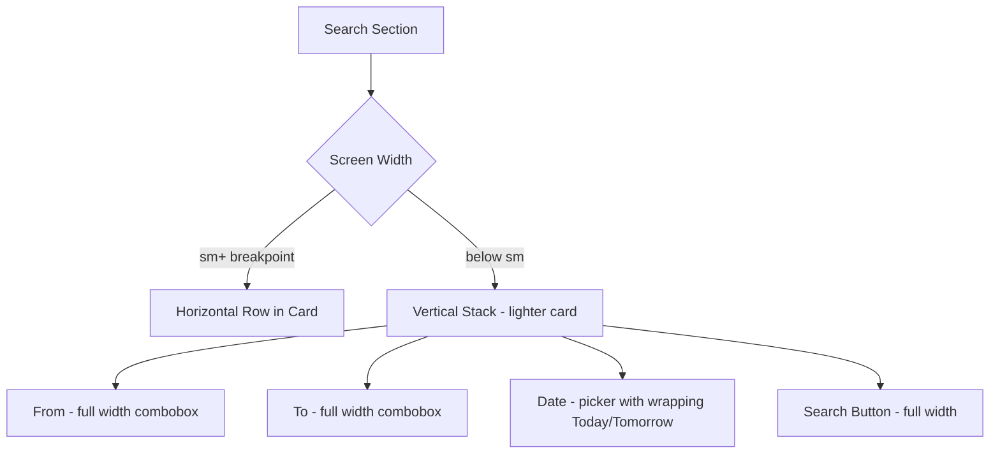

# Mobile Responsive Header & Search Section Plan

## Current State Analysis

### Header ([`header.tsx`](apps/web/src/components/header.tsx))
- Single-row sticky header with logo, "My Bookings" link, and [`UserMenu`](apps/web/src/components/user-menu.tsx) component
- No mobile-specific handling — header text gets cut off on small screens
- No hamburger menu

### Search Section ([`search-section.tsx`](apps/web/src/components/home/search-section.tsx))
- Uses a `Card` with `CardHeader` and `CardContent`
- Layout: `flex-col` on mobile, `flex-row` on `sm:` breakpoint
- Date picker has Today/Tomorrow buttons inline with the calendar trigger
- On mobile, everything stacks vertically but the date row wraps awkwardly

### Available Components
- **Sheet component already exists** at [`sheet.tsx`](apps/web/src/components/ui/sheet.tsx) — uses `@base-ui/react/dialog` with slide-in animations
- Uses `@base-ui/react` (Base UI), `lucide-react` for icons, Tailwind CSS v4

---

## Implementation Plan

### 1. Create MobileNav Component

**File:** `apps/web/src/components/mobile-nav.tsx`

- Hamburger button using `Menu` icon from `lucide-react`
- Opens a [`Sheet`](apps/web/src/components/ui/sheet.tsx) from the right side
- Contains plain navigation links (not nested dropdowns — avoids focus trapping issues):
  - Home
  - My Bookings
  - Sign In / User info + Sign Out (rendered as plain links/buttons, NOT the dropdown `UserMenu`)
- Links close the sheet on click via state management

**Key design decision:** On mobile, the `UserMenu` dropdown is replaced with simple list items. Desktop keeps the dropdown, mobile uses plain links. This avoids nested dialog/dropdown focus trapping issues.

### 2. Update Header Component

**File:** `apps/web/src/components/header.tsx`

Apply component-level responsiveness with CSS visibility:

```tsx
<header>
  <div>
    {/* Logo - always visible, with text overflow protection */}
    <Link href="/">
      <Image ... />
      <span className="truncate max-w-[180px] sm:max-w-none">SudhanBus</span>
    </Link>

    {/* Desktop nav - hidden below md */}
    <div className="hidden md:flex items-center gap-3">
      <Link href="/bookings">My Bookings</Link>
      <UserMenu />
    </div>

    {/* Mobile nav - visible below md only */}
    <div className="block md:hidden">
      <MobileNav />
    </div>
  </div>
</header>
```

### 3. Update Search Section for Mobile

**File:** `apps/web/src/components/home/search-section.tsx`

Target mobile layout:
```
From        [combobox input]
To          [combobox input]
Date        [picker] [Today] [Tomorrow]
[         Search Button          ]
```

Changes:
- **De-emphasize the Card on mobile**: Remove card border/shadow on small screens, keep it on desktop. Use conditional classes like `border-0 shadow-none md:border md:shadow-sm` or similar approach
- **Increase vertical spacing on mobile**: `gap-3 md:gap-4` for breathing room
- **Search button**: Full-width on mobile (`w-full`), auto-width on desktop (`md:w-auto`)
- Keep the existing `flex-col` → `sm:flex-row` responsive behavior

### 4. Update DatePicker for Mobile

**File:** `apps/web/src/components/home/date-picker.tsx`

- Add `flex-wrap` to the date controls row so Today/Tomorrow buttons wrap below the date input on very small screens
- Increase gap on mobile: `gap-2 sm:gap-3`

---

## Architecture Diagram





---

## Files to Create/Modify

| File | Action | Description |
|------|--------|-------------|
| [`sheet.tsx`](apps/web/src/components/ui/sheet.tsx) | **Already exists** | No changes needed |
| `apps/web/src/components/mobile-nav.tsx` | **Create** | Hamburger button + Sheet with plain nav links |
| [`header.tsx`](apps/web/src/components/header.tsx) | **Modify** | Add `hidden md:flex` / `block md:hidden` pattern |
| [`search-section.tsx`](apps/web/src/components/home/search-section.tsx) | **Modify** | De-emphasize card on mobile, full-width search button, better spacing |
| [`date-picker.tsx`](apps/web/src/components/home/date-picker.tsx) | **Modify** | Add `flex-wrap` and better mobile gap |

---

## Implementation Steps

1. **Create `mobile-nav.tsx`** — Hamburger button + Sheet with plain nav links and auth actions
2. **Update `header.tsx`** — Use `hidden md:flex` / `block md:hidden` pattern, add text overflow protection on logo
3. **Update `search-section.tsx`** — De-emphasize Card on mobile, full-width search button, increase mobile spacing
4. **Update `date-picker.tsx`** — Add `flex-wrap` for date controls row
5. **Run `pnpm dlx ultracite fix`** — Ensure code formatting compliance
6. **Test** — Verify in browser at mobile viewport (412px width)
